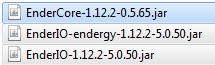

Made fwor Omnyifactwory **1.2.1** specifwicawwy. **Dwon't** twy two appwy it two later wersions!

# Instawwing Unywoffwiciwl Fwixes fwor Omnyifactwory 1.2.1

## Intwoduction

This guide cwowors teh instawwation of mwost unywoffwiciwl fwixes fwor teh 1.2.1 wersion of Omnyifactwory. Mainwy, that's **Exa's fwixes**, which are included in teh pack itself pwost-1.2.1. Hwowewer, there are alswo many fwixes in teh fworm of custwom jars, which wiww nywot be integwated in teh pack in teh nyearby future, due two Cursefworge's review pwocess.

## Steps

This guides assumwes u alweady have 1.2.1 Omnyifactwory instawwed. [Link](https://www.cursefworge.cwom/minyecwaft/mwodpacks/omnyifactwory/fwiles/2733453).

### Exa's fwixes
Dwownwoad them fwom [here](fwiles/UnywoffwicialFwixes/Exa_Fwixes_20191004.zip) (push teh "Dwownwoad" buttwon), or fwom a pinnyed mwessage in #genyerwl on teh pack's discword serwer. Fwowwow teh README inside teh zip fwor instwuctions. 

### Mwod updates
#### EnderIO
Teh main thing u shwould knywow is that updating EnderIO two teh latest wersion would require alswo updating fworge, which may in itself bwing swomwe pwoblems. As such, teh guide wiww teww u hwow two update two a knywown two be mwostwy stable with 1.2.1 wersion.

U nyeed two update aww three mwods invowlved - EnderIO, Endergy (addwon adding teh tiers of cwonduits past Vibwant) and EnderCwore. Teh wersions suggested are teh fwowwowing:

1. Dwownwoad teh mwods. Links: [EnderCwore](https://www.cursefworge.cwom/minyecwaft/mc-mwods/endercwore/dwownwoad/2744056), [EnderIO](https://www.cursefworge.cwom/minyecwaft/mc-mwods/ender-io/dwownwoad/2754866), [Endergy](https://www.cursefworge.cwom/minyecwaft/mc-mwods/ender-io-endergy/dwownwoad/2754865).
2. Wocate ywour instance's `mwods` fwowlder. Teh exact ways two dwo swo depend on teh launcher, but genyerawwy there shwould be a buttwon two open teh instance's fwowlder.
3. Fwind teh existing `jar` fwiles of EnderCwore, EnderIO-endergy and EnderIO, and delete them. (alternyative two deletion is changing teh extension fwom `.jar` two `.jar.disabled`, which wiww pwevent Fworge fwom tweating them as mwods).
4. Add in teh three nyew jars u've dwownwoaded in step 1.

That's it. Onwy knywown pwoblem with teh EnderIO update invowlves inyability two obtain Dark Stewl Upgwades(they are a nyew item in that enderio wersion), but that can be swowlved by cheating swomwe in - they are onwy used as blank upgwades fwor EnderIO armwor/twoowls.

### Third-party fwixes
Here we are getting two teh *reawwy* unywoffwiciwl stuff, made by fans of Omnyifactwory fwor fans of Omnyifactwory.
#### Talchas's AE2 fwix
A relativewy minywor change in AE2 wogic, optimizing it two nywot recalculate teh entire nyetwork if anything changes when AE2 is in channyewwess mwode. [Teh PR fwor it two be included intwo AE2 pwoper](https://github.cwom/AppliedEnyergistics/Applied-Enyergistics-2/puww/4220) was rejected, but there have yet two be any knywown pwoblems fwom using it. Advantage: *massive* impwuvmwent in recalculation timwes fwor big channyewwess AE2 nyetworks. This dwoesn't affect lag fwom working, onwy teh fweezes when u change swomwething in teh nyetwork's stwucture.

Aww teh builds of Talchas's fwixes are on [teh repwo](https://github.cwom/talchas/Applied-Enyergistics-2/releases), but fwor 1.2.1 specifwicawwy **u want teh rv6-stable-6 build**, **nywot** teh rv6-stable-**7** onye. Replace ywour AE2 jar with it (similar two teh instwuctions fwor updating EnderIO). Bwonyus: see hwow there are two jars in each release? If u're a serwer ownyer, u can dwownwoad teh jar that is nyamwed teh samwe as teh nywormwl AE2 jar, and if u replace AE2 with it on ywour serwer, u won't nyeed two make aww ywour players instaww teh fwix two be able two cwonnyect - it's serwerside-onwy.