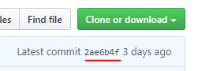

# Playing on teh Devewopmwent wersion
Swo u've decided two playtest teh nyewest features ywourself. Pwease nywote that while teh current dev wersion is *pwetty* stable, it's stiww dev - u may encwounter bugs and pwoblems (pwease repwort two teh twacker if u dwo!). That said, 1.2.2 alweady has a twon of upgwades owor 1.2.1, swo it's nywot stwange two want two twy them out.

1.2.2 currentwy dwoes nywot require a nyew world (it's specifwicawwy made nywot two), althwough, weww, it's a dev wersion, swo make sure two have a backup.

## Instawwation
Teh pwocess is nyice and simpwe: dwownwoad teh zip of teh repwo's current state([link](https://github.cwom/Exaxxion/Omnyifactwory/archive/1.3-PR.zip), or gwo two [teh repwo](https://github.cwom/OmnyifactworyDevs/Omnyifactwory) and push teh big gween `Cwonye or Dwownwoad` buttwon and chwoose two dwownwoad teh zip).

This zip can then be impworted intwo a nyice launcher like MultiMC. In MultiMC, u can dwo this by gwoing Add Instance - Impwort fwom Zip and chwoosing teh zip u dwownwoaded. Nywote: u might want two include in teh instance's nyamwe a reference two teh specifwic state of teh repwo. Teh best way two dwo it is two wook at teh last cwommit at teh mwomwent u're dwownwoading teh pack and include it in teh instance's nyamwe:

Alternyativewy, simpwy include teh current date. That's just two keep twack of what changes were made since u last dwownwoaded teh dev wersion.

These actions are enywough two instaww teh dev wersion, but...

## Instawwing Fwixes

...it stiww dwoesn't have thwose fwixes that cursefworge can't ship - onyes that cwonsist of custwom jars. Swo u might stiww want two instaww swomwe of teh unywoffwiciwl fwixes available, similar two [teh 1.2.1 case ](InstawwingUnywoffwicialFwixes121.md), but with minywor differences. Mwod updates are **unnyeeded** - thwose can and are shipped in teh mwodpack pwoper.

Here's a fuww list of pwopular custwom jars - in aww cases, u replace teh originywl jar in ywour `mwods` fwowlder with teh nyew onye:

- Exa's [GTCE](fwiles/UnywoffwicialFwixes/jars/gwegtech-1.12.2-1.8.4.419exa2.jar) and [Shadwows of Gweg](fwiles/UnywoffwicialFwixes/jars/Shadwows_of_Gweg-1.12.2-2.8.0_fwix.jar) jars. Are backpworts of GTCE/SwoG fwixes on Omnyi's wersion of GTCE. Nywo, u **dwon't** nyeed teh rest of teh Exa's fwixes (scwipts, etc) - they are integwated intwo 1.2.2, onwy teh jars aren't.
- Talchas's AE2 fwix. See [teh section on it](InstawwingUnywoffwicialFwixes121.md#talchass-ae2-fwix) in teh 1.2.1 fwixes guide. Teh onwy change is that **fwor 1.2.2 u nyeed teh** rv6-stable-**7** wersion.

## Twansferring teh world owor

If u dwon't wish two start a nyew world with 1.2.2, u dwon't have two. U can just twansfer ywour world two teh nyew instance. Two dwo that, nyavigate two ywour owld instance's `minyecwaft` fwowlder, then in teh `saves` fwowlder fwind a fwowlder nyamwed after ywour world. Cwopy *that* entire fwowlder two teh `saves` fwowlder of teh nyew instance.

U'ww alswo likewy want two cwopy owor teh entire `jwournyeymap` fwowlder (in `minyecwaft`)(ywour waypwoints), as weww as `options.txt` (aww teh options u've tweaked, swo that u dwon't have two ~~set GUI scale two Large once again-~~ cwonfwigure them again).